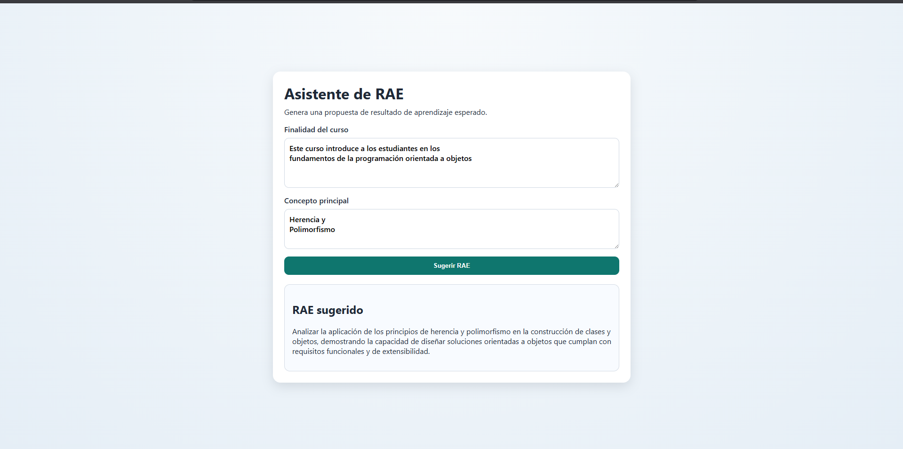

# Prueba Técnica - Embedding Vectors AI LLM

## Descripción general
Este proyecto genera una sugerencia de **Resultado de Aprendizaje Esperado (RAE)** utilizando un LLM.

## Respuesta a la Prueba de Comprensión y Análisis de Requerimientos

La respuesta completa se encuentra en el archivo:

## Prueba de Comprensión y Análisis de Requerimientos

📄 [Ver documento completo en PDF](./Prueba%20requerimentos%20Juan%20Carlos%20Tobon.pdf
)


## Demo en Producción

La aplicación se encuentra desplegada en:
- **Frontend:** Vercel  
- **Backend:** Render  

🔗 [Acceder a la aplicación](https://techincal-test-embedding-vectors-ai.vercel.app/)

> En caso de una ligera demora inicial, el backend puede estar reactivándose desde estado de inactividad (*cold start*).  



**Contiene**:
- `backend/`: API con Django + Django REST Framework
- `frontend/`: cliente con React + Vite

## Requisitos
- Python 3.11+
- Node.js 20+ y npm
- Una API key para el proveedor LLM configurado (por defecto: API compatible con OpenAI)

## Ejecutar el proyecto

### 1) Iniciar el backend
Desde la raíz del proyecto:

Windows
```powershell
cd backend

# Ensure correct Python exists
py -3.11 --version

# Create clean env
py -3.11 -m venv .venv

# Activate
.\.venv\Scripts\Activate.ps1

# Upgrade core tooling
python -m pip install --upgrade pip setuptools wheel

# Install deps
pip install -r requirements.txt

# Only create .env if missing
if (!(Test-Path .env)) { Copy-Item .env.example .env }

# Run
python manage.py runserver 8000

```
Linux
```powershell

cd backend

python3.11 -m venv .venv

source .venv/bin/activate

python -m pip install --upgrade pip setuptools wheel

pip install -r requirements.txt

[ -f .env ] || cp .env.example .env

python manage.py runserver 8000
```

URLs del backend:
- `http://127.0.0.1:8000`
- Ruta base de la API: `http://127.0.0.1:8000/api`


### 2) Iniciar el frontend
En una terminal nueva:

```powershell
cd frontend
npm install
npm run dev
```

URL del frontend:
- `http://localhost:5173`

Nota importante sobre el destino de la API:
- Por defecto, las solicitudes del frontend apuntan a la API desplegada en `frontend/src/api/httpClient.js`.
- Para ejecutar el stack completo en local, cambia `baseURL` en `frontend/src/api/httpClient.js` por:

```text
http://127.0.0.1:8000/api
```

## Endpoint de la API
- `POST /api/sugerir-rae/`

Ejemplo de solicitud:

```json
{
  "finalidad_curso": "Fortalecer el análisis cuantitativo para la toma de decisiones en ingeniería",
  "concepto_principal": "estadística aplicada"
}
```

Ejemplo de respuesta:

```json
{
  "rae_sugerido": "Analizar datos estadísticos para justificar decisiones técnicas en contextos profesionales."
}
```

## Variables de entorno (`backend/.env`)
Plantilla base:

```env
DJANGO_SECRET_KEY=change-me
DJANGO_DEBUG=1
DJANGO_ALLOWED_HOSTS=localhost,127.0.0.1
DJANGO_CORS_ALLOWED_ORIGINS=http://localhost:5173
DJANGO_LOG_LEVEL=INFO

LLM_PROVIDER=openai
AI_API_KEY=your-openai-api-key
AI_API_URL=https://api.openai.com/v1
AI_CHAT_MODEL=gpt-4o-mini
AI_TIMEOUT_SECONDS=20
AI_MAX_RETRIES=3
AI_BACKOFF_MIN=1
AI_BACKOFF_MAX=8
```

## Ejecutar pruebas

```powershell
cd backend
.\.venv\Scripts\Activate.ps1
python manage.py test
```

## Prompt exacto usado para el modelo de IA
El backend construye esta plantilla exacta en `backend/learning_outcomes/services/prompt_builder.py`:

```text
Eres un especialista en diseño curricular universitario con experiencia en formulación de Planes de Desarrollo de Curso (PDC) y alineación por competencias.

Contexto institucional obligatorio:
{institutional_context}

Datos del curso:
- Finalidad del curso: {finalidad_curso}
- Concepto principal: {concepto_principal}

Restricciones:
- Genera un único Resultado de Aprendizaje Esperado (RAE).
- Debe ser una sola oración.
- Inicia con un verbo en infinitivo de alto nivel de Bloom: Analizar, Evaluar, Crear, Diseñar, Formular, Sintetizar, Aplicar, Justificar, Comparar, Integrar.
- Debe ser claro, medible, centrado en el estudiante y evidenciable.
- No incluyas explicaciones, listas, comillas ni texto adicional.
- Mantén estrictamente la redacción académica y en tercera persona.
- No agregues contenido fuera del contexto institucional ni ejemplos.

Entrega:
- Solo la oración final del RAE, nada más.
```

Contexto institucional actual inyectado por el backend (`backend/learning_outcomes/services/institutional_context.py`):

```text
Todos los RAE en la universidad deben seguir la Taxonomía de Bloom y comenzar con un verbo en infinitivo de nivel superior (ej: Analizar, Evaluar, Crear). Deben ser centrados en el estudiante y evidenciables.
```
